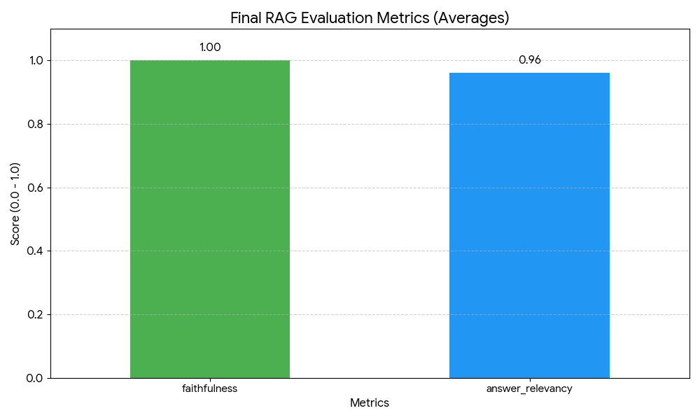
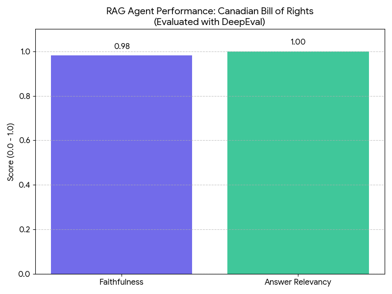

# Multi-Doc RAG Agent 📚🤖

A production-grade conversational RAG agent for querying multiple PDF documents. Built with LangChain, Streamlit, and FastAPI — featuring two-stage retrieval with reranking, token-by-token streaming, structured output, LLM-based guardrails, and a full CI/CD pipeline.


---

## Features

- **Two-Stage Retrieval:** ChromaDB vector search (k=20) → FlashRank cross-encoder reranker (top 5). Bi-encoder for recall, cross-encoder for precision.
- **Streaming Responses:** Token-by-token streaming via `chain.stream()`. Spinner covers retrieval latency; `st.write_stream()` renders tokens as they arrive.
- **Structured Output:** `RAGResponse(answer, sources)` Pydantic model via `llm.with_structured_output()` — typed, validated, no regex parsing.
- **FastAPI Endpoint:** `POST /query` returns `RAGResponse` JSON. Async `ainvoke()`, lifespan startup, Swagger UI at `/docs`.
- **LLM Guardrail:** Zero-temperature binary classifier (`LegalGuardrail`) blocks out-of-scope queries before the RAG pipeline is triggered.
- **Evaluation Suite:** Ragas (faithfulness, answer relevancy), DeepEval (14 synthetic test cases), and custom guardrail tests — all with CSV reports.
- **CI/CD Pipeline:** GitHub Actions — guardrail tests gate Docker build/push to GHCR. SHA + latest tagging, registry layer caching.
- **Conversational Memory:** `RunnableWithMessageHistory` persists chat context across turns. Full history auto-saved after each streamed response.

---

## Architecture

```
PDF Upload → Chunking (1000 tokens, 200 overlap)
          → OpenAI Embeddings → ChromaDB (persisted)

Query → LegalGuardrail (LLM binary classifier)
      → ChromaDB k=20 (vector similarity)
      → FlashRank cross-encoder → top 5 chunks
      → LangChain LCEL chain → GPT-4o
      → Streamlit: token-by-token streaming
      → FastAPI /query: RAGResponse JSON
```

---

## Tech Stack

| Layer | Tools |
| :--- | :--- |
| **LLM & Orchestration** | LangChain 1.4.0, LangSmith, OpenAI GPT-4o |
| **Retrieval** | ChromaDB, FlashRank (ms-marco-MultiBERT-L-12), OpenAI Embeddings |
| **UI** | Streamlit |
| **API** | FastAPI, Uvicorn |
| **Evaluation** | Ragas, DeepEval, Guardrails AI |
| **CI/CD** | GitHub Actions, Docker, GHCR |

---

## Getting Started

### Prerequisites
- Python 3.13
- OpenAI API Key
- LangChain API Key (for LangSmith tracing)

### Installation

```bash
git clone https://github.com/JiviteshG/multidoc-rag-agent_langchain.git
cd multidoc-rag-agent_langchain
python -m venv venv
venv\Scripts\activate      # Windows
# source venv/bin/activate  # macOS/Linux
pip install -r requirements.txt
```

### Environment Variables

Create a `.env` file in the project root:

```
OPENAI_API_KEY=your_openai_api_key
LANGCHAIN_API_KEY=your_langchain_api_key
LANGCHAIN_TRACING_V2=true
LANGCHAIN_PROJECT=multidoc-rag-agent
```

### Run the Streamlit App

```bash
streamlit run app.py
```

1. Upload PDF documents via the sidebar.
2. Click **Process** to chunk and embed into ChromaDB.
3. Ask questions in the chat input — answers stream token-by-token.

### Run the FastAPI Endpoint

```bash
uvicorn api:app --reload --port 8000
```

- `POST /query` — submit a question, receive `{"answer": "...", "sources": ["file.pdf, Page N"]}`
- `GET /health` — liveness check
- `GET /docs` — Swagger UI with full schema

```bash
curl -X POST http://localhost:8000/query \
  -H "Content-Type: application/json" \
  -d '{"query": "What rights are protected under the Canadian Bill of Rights?"}'
```

### Docker

```bash
docker build -t multidoc-rag-agent .
docker-compose up
```

Or pull the latest image from GHCR:

```bash
docker pull ghcr.io/jiviteshg/multidoc-rag-agent:latest
```

---

## Repository Structure

```
multidoc-rag-agent_langchain/
├── app.py                        # Streamlit app + RAG chain + streaming logic
├── api.py                        # FastAPI /query endpoint
├── htmlTemplates.py              # Chat UI HTML/CSS templates
├── requirements.txt
├── Dockerfile
├── docker-compose.yml
├── .github/workflows/ci.yml      # CI/CD pipeline
├── logic_guards/
│   └── input_guards.py           # LegalGuardrail — LLM binary classifier
├── evals/
│   ├── run_guardrail_tests.py    # Guardrail test suite (runs in CI)
│   ├── run_ragas_eval.py         # Ragas evaluation (manual)
│   ├── run_deepeval_evals.py     # DeepEval evaluation (manual)
│   └── results/                  # CSV reports
└── chroma_db/                    # Persisted vector store
```

---

## CI/CD Pipeline

GitHub Actions workflow (`.github/workflows/ci.yml`):

1. **Guardrail Tests** — runs on every push and pull request. Installs dependencies, runs `evals/run_guardrail_tests.py`, uploads CSV report as artifact.
2. **Docker Build & Push** — runs only on `main` after tests pass. Builds image, pushes to GHCR with `sha-<commit>` and `latest` tags, uses registry layer caching.

Secrets required: `OPENAI_API_KEY`, `LANGCHAIN_API_KEY` (GITHUB_TOKEN auto-provided).

---

## Evaluation Results

### Ragas (faithfulness + answer relevancy)

Evaluated against a golden dataset of Canadian Bill of Rights questions.

| Metric | Score |
| :--- | :--- |
| **Faithfulness** | 1.00 |
| **Answer Relevancy** | 0.96 |



### DeepEval (14 synthetic test cases)

| Metric | Score |
| :--- | :--- |
| **Faithfulness** | 0.98 |
| **Answer Relevancy** | 1.00 |



### Unit Tests (23 test cases — no LLM calls, ~30s)

```bash
pytest tests/ -v
```

| Test Module | Coverage |
| :--- | :--- |
| `test_app.py` | `split_documents`, `_format_bot_content`, `RAGResponse`, `vectorstore_exists` |
| `test_api.py` | `/health`, `/query` (mocked chain), guardrail rejection, schema validation |

### Guardrail (6 test cases — legal, out-of-scope, adversarial)

| Metric | Score |
| :--- | :--- |
| **Accuracy** | 100% |
| **Legal Query Recall** | 100% |
| **Out-of-Scope Filtering** | 100% |

---

## License

MIT
